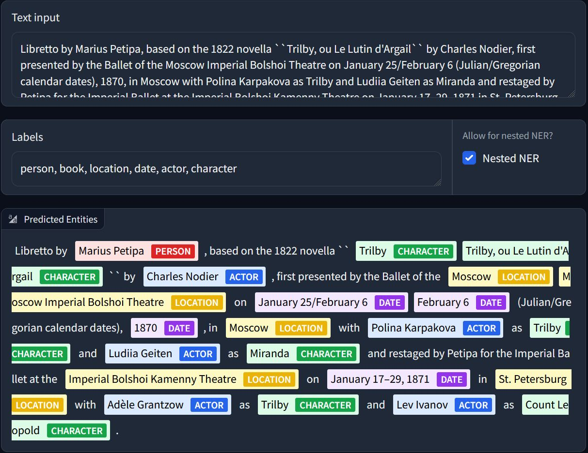

# GLiNER : Generalist and Lightweight model for Named Entity Recognition

GLiNER is a Named Entity Recognition (NER) model capable of identifying any entity type using a bidirectional transformer encoder (BERT-like). It provides a practical alternative to traditional NER models, which are limited to predefined entities, and Large Language Models (LLMs) that, despite their flexibility, are costly and large for resource-constrained scenarios.

* Paper: https://arxiv.org/abs/2311.08526 (by Urchade Zaratiana, Nadi Tomeh, Pierre Holat, Thierry Charnois)
* Demo: https://huggingface.co/spaces/tomaarsen/gliner_base
* Colab: https://colab.research.google.com/drive/1mhalKWzmfSTqMnR0wQBZvt9-ktTsATHB?usp=sharing



## Models Status
### 📢 Updates
- 📝 Finetuning notebook is available: examples/finetune.ipynb
- 🗂 Training dataset preprocessing scripts are now available in the `data/` directory, covering both [Pile-NER](https://huggingface.co/datasets/Universal-NER/Pile-NER-type) 📚 and [NuNER](https://huggingface.co/datasets/numind/NuNER) 📘 datasets.

### Available Models on Hugging Face
- [x] [GLiNER-Base](https://huggingface.co/urchade/gliner_base) (CC BY NC 4.0)
- [x] [GLiNER-Multi](https://huggingface.co/urchade/gliner_multi) (CC BY NC 4.0)
- [x] [GLiNER-small](https://huggingface.co/urchade/gliner_small) (CC BY NC 4.0)
- [x] [GLiNER-small-v2](https://huggingface.co/urchade/gliner_smallv2) (Apache)
- [x] [GLiNER-medium](https://huggingface.co/urchade/gliner_medium) (CC BY NC 4.0)
- [x] [GLiNER-medium-v2](https://huggingface.co/urchade/gliner_mediumv2) (Apache)
- [x] [GLiNER-large](https://huggingface.co/urchade/gliner_large) (CC BY NC 4.0)
- [x] [GLiNER-large-v2](https://huggingface.co/urchade/gliner_largev2) (Apache)

### To Release
- [ ] ⏳ GLiNER-Multiv2
- [ ] ⏳ GLiNER-Sup (trained on mixture of NER datasets)

## Area of improvements / research

- [ ] Allow longer context (eg. train with long context transformers such as Longformer, LED, etc.)
- [ ] Use Bi-encoder (entity encoder and span encoder) allowing precompute entity embeddings
- [ ] Filtering mechanism to reduce number of spans before final classification to save memory and computation when the number entity types is large
- [ ] Improve understanding of more detailled prompts/instruction, eg. "Find the first name of the person in the text"
- [ ] Better loss function: for instance use ```Focal Loss``` (see [this paper](https://proceedings.neurips.cc/paper/2020/file/aeb7b30ef1d024a76f21a1d40e30c302-Paper.pdf)) instead of ```BCE``` to handle class imbalance, as some entity types are more frequent than others
- [ ] Improve multi-lingual capabilities: train on more languages, and use multi-lingual training data
- [ ] Decoding: allow a span to have multiple labels, eg: "Cristiano Ronaldo" is both a "person" and "football player"
- [ ] Dynamic thresholding (in ```model.predict_entities(text, labels, threshold=0.5)```): allow the model to predict more entities, or less entities, depending on the context. Actually, the model tend to predict less entities where the entity type or the domain are not well represented in the training data.
- [ ] Train with EMAs (Exponential Moving Averages) or merge multiple checkpoints to improve model robustness (see [this paper](https://openreview.net/forum?id=tq_J_MqB3UB)
- [ ] Extend the model to relation extraction but need dataset with relation annotations. Our preliminary work [ATG](https://github.com/urchade/ATG).


## Installation
To use this model, you must install the GLiNER Python library:
```
!pip install gliner
```

## Usage
Once you've downloaded the GLiNER library, you can import the GLiNER class. You can then load this model using `GLiNER.from_pretrained` and predict entities with `predict_entities`.

```python
from gliner import GLiNER

model = GLiNER.from_pretrained("urchade/gliner_base")

text = """
Cristiano Ronaldo dos Santos Aveiro (Portuguese pronunciation: [kɾiʃˈtjɐnu ʁɔˈnaldu]; born 5 February 1985) is a Portuguese professional footballer who plays as a forward for and captains both Saudi Pro League club Al Nassr and the Portugal national team. Widely regarded as one of the greatest players of all time, Ronaldo has won five Ballon d'Or awards,[note 3] a record three UEFA Men's Player of the Year Awards, and four European Golden Shoes, the most by a European player. He has won 33 trophies in his career, including seven league titles, five UEFA Champions Leagues, the UEFA European Championship and the UEFA Nations League. Ronaldo holds the records for most appearances (183), goals (140) and assists (42) in the Champions League, goals in the European Championship (14), international goals (128) and international appearances (205). He is one of the few players to have made over 1,200 professional career appearances, the most by an outfield player, and has scored over 850 official senior career goals for club and country, making him the top goalscorer of all time.
"""

labels = ["person", "award", "date", "competitions", "teams"]

entities = model.predict_entities(text, labels, threshold=0.5)

for entity in entities:
    print(entity["text"], "=>", entity["label"])
```

```
Cristiano Ronaldo dos Santos Aveiro => person
5 February 1985 => date
Al Nassr => teams
Portugal national team => teams
Ballon d'Or => award
UEFA Men's Player of the Year Awards => award
European Golden Shoes => award
UEFA Champions Leagues => competitions
UEFA European Championship => competitions
UEFA Nations League => competitions
Champions League => competitions
European Championship => competitions
```

## Named Entity Recognition benchmark result


## Model Authors
The model authors are:
* [Urchade Zaratiana](https://huggingface.co/urchade)
* Nadi Tomeh
* Pierre Holat
* Thierry Charnois

## Citation
```bibtex
@misc{zaratiana2023gliner,
      title={GLiNER: Generalist Model for Named Entity Recognition using Bidirectional Transformer}, 
      author={Urchade Zaratiana and Nadi Tomeh and Pierre Holat and Thierry Charnois},
      year={2023},
      eprint={2311.08526},
      archivePrefix={arXiv},
      primaryClass={cs.CL}
}
```
