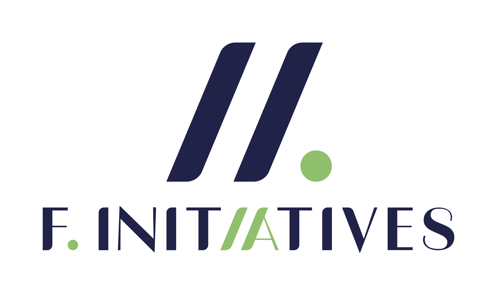

<div align="center">

# GLiNER: Generalist and Lightweight Model for Named Entity Recognition

**Zero-shot NER | Relation Extraction | PII Detection | Information Extraction | Token Classification**

<div>
    <!-- Docs & Resources -->
    <a href="https://urchade.github.io/GLiNER"></a>
    <a href="https://arxiv.org/abs/2311.08526"></a>
    <a href="https://colab.research.google.com/drive/1mhalKWzmfSTqMnR0wQBZvt9-ktTsATHB?usp=sharing"></a>
    <a href="https://github.com/urchade/GLiNER/blob/main/LICENSE"></a>
    <br>
    <!-- Community -->
    <a href="https://discord.gg/x7hQsjX2Kk"></a>
    <a href="https://www.reddit.com/r/GLiNER/"></a>
    <a href="https://huggingface.co/spaces/urchade/gliner_mediumv2.1"></a>
    <a href="https://huggingface.co/models?library=gliner&sort=trending"></a>
    <br>
    <!-- Stats -->
    <a href="https://clickpy.clickhouse.com/dashboard/gliner"></a>
    <a href="https://github.com/urchade/GLiNER"></a>
</div>
<br>
</div>


<div align="center">
  
</div>

GLiNER is a framework for training and deploying small Named Entity Recognition (NER) models with zero-shot capabilities. In addition to traditional NER, it also supports joint entity and relation extraction, as well as multi-task token classification. GLiNER is fine-tunable, optimized to run on CPUs and consumer hardware, and has performance competitive with LLMs several times its size, like ChatGPT and UniNER.

Other tasks such as text classification, entity linking, and schema extraction are supported through projects in the [Ecosystem](#ecosystem).

---

## Why GLiNER?

<table>
<tr>
<td width="33%" align="center">
<h3>Zero-shot Recognition</h3>
<p>Extract any entity type — no labeled data or task-specific training required</p>
</td>
<td width="33%" align="center">
<h3>Runs Anywhere</h3>
<p>CPU, INT8 quantization, <code>torch.compile</code>, ONNX export — deploy on any hardware</p>
</td>
<td width="33%" align="center">
<h3>Millions of Labels</h3>
<p>Bi-encoder pre-computes label embeddings, scaling to 100+ entity types without degradation</p>
</td>
</tr>
<tr>
<td width="33%" align="center">
<h3>NER + Relations</h3>
<p>Build knowledge graphs in a single pass with the joint RelEx architecture</p>
</td>
<td width="33%" align="center">
<h3>PII Detection</h3>
<p>State-of-the-art multilingual PII models covering major entity types across 100+ languages</p>
</td>
<td width="33%" align="center">
<h3>Fine-Tune in Minutes</h3>
<p>Few-shot learning on small datasets — bring your own labels and get competitive results fast</p>
</td>
</tr>
</table>

---

## Quick Start

### Installation

```bash
pip install gliner
```

### Basic Usage

```python
from gliner import GLiNER

model = GLiNER.from_pretrained("gliner-community/gliner_small-v2.5")

text = """
Cristiano Ronaldo dos Santos Aveiro (born 5 February 1985) is a Portuguese
professional footballer who plays as a forward for and captains both Saudi Pro
League club Al Nassr and the Portugal national team.
"""

labels = ["person", "date", "organization", "location"]

entities = model.predict_entities(text, labels, threshold=0.5)

for entity in entities:
    print(entity["text"], "=>", entity["label"])
```

**Output:**
```
Cristiano Ronaldo dos Santos Aveiro => person
5 February 1985 => date
Al Nassr => organization
Portugal => location
```

### Quantization and Compilation

Use `quantize=True` and `compile_torch_model=True` for up to ~1.9x faster GPU inference with zero quality loss:

```python
model = GLiNER.from_pretrained(
    "gliner-community/gliner_small-v2.5",
    map_location="cuda",
    quantize=True,
    compile_torch_model=True,
)
```

## Serving

GLiNER provides a built-in serving interface for batch inference:

```python
from gliner.serve import GLiNERFactory

with GLiNERFactory(
    model="gliner-community/gliner_small-v2.5",
    dtype="bfloat16",
    enable_flashdeberta=True,
) as llm:
    outputs = llm.predict(
        ["John works at Google", "Paris is in France"],
        labels=["person", "organization", "location"],
    )
```

---

## Training

GLiNER models are easy to fine-tune on your own data. Prepare your dataset as a JSON file and use the training script:

```bash
python train.py --config configs/config.yaml
```

Or train programmatically:

```python
from gliner import GLiNER

model = GLiNER.from_pretrained("gliner-community/gliner_small-v2.5")

model.train_model(
    train_dataset=train_data,
    eval_dataset=eval_data,
    output_dir="models",
    max_steps=10000,
    per_device_train_batch_size=8,
    learning_rate=1e-5,
    bf16=True,
)
```

For detailed training examples, see the [example notebooks](https://github.com/urchade/GLiNER/tree/main/examples):
- [Fine-tuning on Colab](https://colab.research.google.com/drive/1HNKd74cmfS9tGvWrKeIjSxBt01QQS7bq?usp=sharing)
- [ONNX Conversion](https://github.com/urchade/GLiNER/blob/main/examples/convert_to_onnx.ipynb)
- [Synthetic Data Generation](https://github.com/urchade/GLiNER/blob/main/examples/synthetic_data_generation.ipynb)

---

## Architectures

GLiNER supports multiple architectures tailored to different use cases:

| Architecture | Description |
|---|---|
| **Uni-encoder** | Strong zero-shot capabilities, supports up to ~50 entity types. The original GLiNER architecture. |
| **Bi-encoder** | Scalable to massive numbers of entity types via separate text and label encoding. |
| **RelEx** | Joint NER and relation extraction in a single model. |
| **GLiNER Decoder** | Hybrid architecture for open NER — entity types are generated with a small decoder for maximum flexibility. |

For more details, see the [documentation](https://urchade.github.io/GLiNER).

---

## Popular Use Cases

- **Compliance & PII Redaction** — detect and mask 40+ types of personal data (SSN, credit cards, passports, emails, IBANs, etc.) across documents and data pipelines
- **Knowledge Graph Construction** — jointly extract entities and relations to power Graph RAG, semantic search, and analytics
- **Large-Scale Entity Extraction** — use the bi-encoder to tag millions of documents against hundreds or thousands of entity types in production
- **Domain-Specific NER** — fine-tune on biomedical, legal, financial, or any specialized corpus with minimal labeled data
- **Multi-lingual Information Extraction** — extract structured data from 100+ languages with a single model
- **Search & Retrieval Augmentation** — parse queries into structured entities to improve search relevance and RAG pipelines

---

## Ecosystem

GLiNER has a rich ecosystem of community projects and integrations:

| Project | Description |
|---|---|
| [GLiNER2](https://github.com/fastino-ai/GLiNER2) | Unified multi-task model for NER, text classification, and structured data extraction |
| [GLiClass](https://github.com/Knowledgator/GLiClass) | Zero-shot text classification using GLiNER-style architecture |
| [GLinker](https://github.com/Knowledgator/GLinker) | Entity linking with GLiNER |
| [GLiNER.cpp](https://github.com/Knowledgator/GLiNER.cpp) | C++ implementation for high-performance inference |
| [gline-rs](https://github.com/fbilhaut/gline-rs) | Rust implementation of GLiNER |
| [vllm-factory](https://github.com/ddickmann/vllm-factory) | vLLM integration for scalable GLiNER serving |
| [gliner-spacy](https://github.com/theirstory/gliner-spacy) | spaCy integration for GLiNER |

---

## Documentation

Full documentation is available at [urchade.github.io/GLiNER](https://urchade.github.io/GLiNER).

---

## Authors & Maintainers

GLiNER was originally developed by:
* [Urchade Zaratiana](https://www.linkedin.com/in/urchade-zaratiana-36ba9814b/)
* Nadi Tomeh
* Pierre Holat
* Thierry Charnois

Alternative architectures, such as bi-encoder, GLiNER-relex were developed by [Ihor Stepanov](https://www.linkedin.com/in/ihor-knowledgator/)


### Maintainers

<div align="center">
  <table>
    <tr>
      <td align="center">
        <strong>Urchade Zaratiana</strong><br>
        <em>Member of technical staff at Fastino</em><br>
        <a href="https://www.linkedin.com/in/urchade-zaratiana-36ba9814b/"></a>
      </td>
      <td align="center">
        <strong>Ihor Stepanov</strong><br>
        <em>Co-Founder at Knowledgator</em><br>
        <a href="https://www.linkedin.com/in/ihor-knowledgator/"></a>
      </td>
    </tr>
  </table>
</div>

---

## Community

- [Discord — GLiNER Community](https://discord.gg/x7hQsjX2Kk)
- [Reddit — r/GLiNER](https://www.reddit.com/r/GLiNER/)
- [HuggingFace](https://huggingface.co/gliner-community)

---

## Contributing

We welcome contributions from the community! Here's how to get started:

1. **Fork** the repository and create a new branch from `main`.
2. **Install** the development dependencies: `pip install -e ".[dev]"`.
3. **Make your changes** — bug fixes, new features, documentation improvements, and new examples are all appreciated.
4. **Lint and format** your code with [Ruff](https://docs.astral.sh/ruff/) before committing:
   ```bash
   ruff check . --fix
   ruff format .
   ```
5. **Write tests** for any new functionality and make sure existing tests pass.
6. **Submit a pull request** with a clear description of what you changed and why.

For bug reports and feature requests, please [open an issue](https://github.com/urchade/GLiNER/issues). For questions and discussions, join us on [Discord](https://discord.gg/x7hQsjX2Kk).

---

## Citations

If you find GLiNER useful in your research, please consider citing our papers:

```bibtex
@inproceedings{zaratiana-etal-2024-gliner,
    title = "{GL}i{NER}: Generalist Model for Named Entity Recognition using Bidirectional Transformer",
    author = "Zaratiana, Urchade  and
      Tomeh, Nadi  and
      Holat, Pierre  and
      Charnois, Thierry",
    editor = "Duh, Kevin  and
      Gomez, Helena  and
      Bethard, Steven",
    booktitle = "Proceedings of the 2024 Conference of the North American Chapter of the Association for Computational Linguistics: Human Language Technologies (Volume 1: Long Papers)",
    month = jun,
    year = "2024",
    address = "Mexico City, Mexico",
    publisher = "Association for Computational Linguistics",
    url = "https://aclanthology.org/2024.naacl-long.300",
    doi = "10.18653/v1/2024.naacl-long.300",
    pages = "5364--5376",
}
```

```bibtex
@misc{stepanov2024glinermultitaskgeneralistlightweight,
      title={GLiNER multi-task: Generalist Lightweight Model for Various Information Extraction Tasks}, 
      author={Ihor Stepanov and Mykhailo Shtopko},
      year={2024},
      eprint={2406.12925},
      archivePrefix={arXiv},
      primaryClass={cs.LG},
      url={https://arxiv.org/abs/2406.12925}, 
}
```

```bibtex
@misc{stepanov2026millionlabelnerbreakingscale,
      title={The Million-Label NER: Breaking Scale Barriers with GLiNER bi-encoder}, 
      author={Ihor Stepanov and Mykhailo Shtopko and Dmytro Vodianytskyi and Oleksandr Lukashov},
      year={2026},
      eprint={2602.18487},
      archivePrefix={arXiv},
      primaryClass={cs.CL},
      url={https://arxiv.org/abs/2602.18487}, 
}
```

## Support and Funding

This project has been supported and funded by **F.initiatives** and **Laboratoire Informatique de Paris Nord**.

F.initiatives has been an expert in public funding strategies for R&D, Innovation, and Investments (R&D&I) for over 20 years. With a team of more than 200 qualified consultants, F.initiatives guides its clients at every stage of developing their public funding strategy: from structuring their projects to submitting their aid application, while ensuring the translation of their industrial and technological challenges to public funders. Through its continuous commitment to excellence and integrity, F.initiatives relies on the synergy between methods and tools to offer tailored, high-quality, and secure support.

<p align="center">
  
</p>

We also extend our heartfelt gratitude to the open-source community for their invaluable contributions, which have been instrumental in the success of this project. ❤️

---

<div align="center">
<sub>GLiNER — open-source named entity recognition, zero-shot NER, relation extraction, PII detection, information extraction, knowledge graph construction, NLP, natural language processing, token classification, text mining, lightweight NER model, transformer-based NER</sub>
</div>
