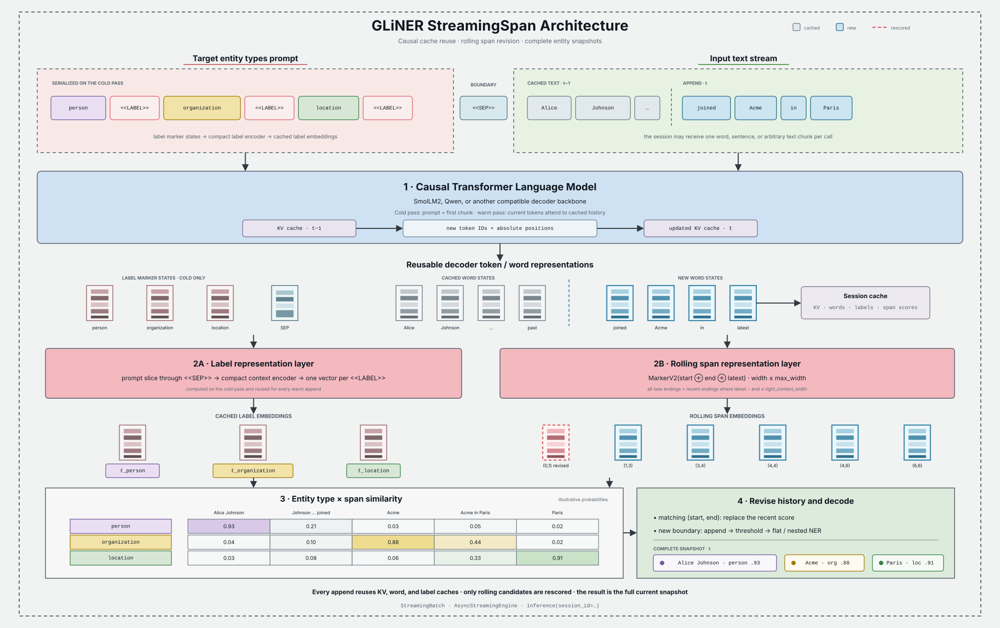

# Advanced Usage

## 🚀 Basic Use Case

After installing the GLiNER library, import the `GLiNER` class. You can load your chosen model with `GLiNER.from_pretrained` and use `inference` to identify entities within your text.

```python
from gliner import GLiNER

# Load a GLiNER model
model = GLiNER.from_pretrained("urchade/gliner_small-v2.1")

# Sample text for entity prediction
text = """
Cristiano Ronaldo dos Santos Aveiro (Portuguese pronunciation: [kɾiʃˈtjɐnu ʁɔˈnaldu]; 
born 5 February 1985) is a Portuguese professional footballer who plays as a forward for 
and captains both Saudi Pro League club Al Nassr and the Portugal national team. Widely 
regarded as one of the greatest players of all time, Ronaldo has won five Ballon d'Or 
awards, a record three UEFA Men's Player of the Year Awards, and four European Golden 
Shoes, the most by a European player.
"""

# Define labels for entity extraction
labels = ["person", "award", "date", "teams", "competition"]

# Perform entity prediction
entities = model.predict_entities(text, labels, threshold=0.5)

# Display predicted entities and their labels
for entity in entities:
    print(entity["text"], "=>", entity["label"])
```

<details>
<summary>Expected Output</summary>

```bash
Cristiano Ronaldo dos Santos Aveiro => person
5 February 1985 => date
Al Nassr => teams
Portugal national team => teams
Ballon d'Or => award
UEFA Men's Player of the Year Awards => award
European Golden Shoes => award
```
</details>

### Understanding the Output

Each predicted entity is a dictionary with the following structure:

```python
{
    'start': int,      # Start character position in text
    'end': int,        # End character position in text
    'text': str,       # Extracted text span
    'label': str,      # Predicted entity type
    'score': float     # Confidence score (0-1)
}
```

Example:
```python
for entity in entities:
    print(f"Text: {entity['text']}")
    print(f"Label: {entity['label']}")
    print(f"Score: {entity['score']:.3f}")
    print(f"Position: [{entity['start']}:{entity['end']}]")
    print("---")
```

### Returning contextual vectors

Native PyTorch models can return the contextual representation of every
accepted entity together with the representation of its matched label. The two
options are independent and are disabled by default:

```python
entities = model.predict_entities(
    text,
    labels,
    return_vectors=True,
    return_label_vectors=True,
)

for entity in entities:
    span_vector = entity["vector"]
    label_vector = entity["label_vector"]
```

`inference` supports the same options for batched input:

```python
all_entities = model.inference(
    texts,
    labels,
    batch_size=8,
    return_vectors=True,
    return_label_vectors=True,
)
```

The optional values are detached CPU NumPy arrays with `float32` dtype. Their
meaning depends on the model architecture:

- For a span-level model, `vector` is the native contextual span
  representation used by the span scorer.
- For a token-level model, `vector` is the mean of the contextual word
  representations covered by the detected span.
- `label_vector` is the matched model prompt representation. When labels are
  supplied as a label-to-description mapping, this is the representation of
  the description prompt while `entity["label"]` remains the mapping key.
  For a generative model in prompt mode, it still represents the original
  scoring prompt; generated label text is not encoded a second time.

The mean-pooled token-level `vector` is not guaranteed to reproduce the entity
score when combined with `label_vector`; in particular, standard token-level
decoding uses the nonlinear start/end/inside scorer. Both arrays are intended
as contextual features for a downstream model.
Only entities that survive thresholding and overlap filtering receive vectors.
When the flags are `False`, the corresponding keys are absent, preserving the
standard result format and inference cost.

NumPy arrays are not directly JSON serializable. Convert them with `.tolist()`
when a JSON-compatible response is required.

:::{note}
Vector returns currently require native PyTorch inference. Existing ONNX and
OpenVINO exports do not expose these intermediate representations and raise
`NotImplementedError` when either option is requested. Stateless inference with
a streaming-span model is supported, but stateful streaming sessions do not
currently return vectors.
:::

:::{warning}
Stateless GLiNER calls do not automatically window long documents. If the text
contains more splitter tokens than the checkpoint's `model.config.max_len`,
GLiNER 0.2.27 warns and predicts from only the retained prefix; the returned
entities contain no truncation flag. Check the limit before inference or split
the document into overlapping windows. See [Input limits and
truncation](#input-limits-and-truncation) for the exact token definition, a public preflight
example, prompt-budget details, and architecture-specific behavior.
:::

## Batch Processing

For processing multiple texts efficiently, use the `inference` method:

```python
from gliner import GLiNER

model = GLiNER.from_pretrained("urchade/gliner_small-v2.1")

# Multiple texts to process
texts = [
    "Apple Inc. was founded by Steve Jobs in Cupertino, California.",
    "Google LLC is headquartered in Mountain View.",
    "Amazon was started by Jeff Bezos in Seattle."
]

labels = ["organization", "person", "location"]

# Process all texts at once
all_entities = model.inference(texts, labels, batch_size=3, threshold=0.5)

# Display results for each text
for i, entities in enumerate(all_entities):
    print(f"\nText {i+1}: {texts[i]}")
    print("Entities:")
    for entity in entities:
        print(f"  - {entity['text']} ({entity['label']}): {entity['score']:.2f}")
```

**Benefits of Batch Processing:**
- **Faster**: Process multiple texts in parallel
- **Efficient**: Better GPU utilization
- **Scalable**: Handle large document collections

### Label descriptions

Models trained to use descriptive labels can receive a dictionary mapping label names
to descriptions. Dictionary keys are returned in predictions, while values are encoded
as the label prompts. For a single text, put all labels in **one dictionary**:

```python
text = "Microsoft was founded by Bill Gates and Paul Allen."
labels = {
    "person": "A human individual, including fictional characters",
    "organization": "A company, institution, agency, or other group of people",
}
entities = model.predict_entities(text, labels)

for entity in entities:
    print(entity["text"], "=>", entity["label"])
```

For a batch that shares the same labels and descriptions, pass that dictionary directly:

```python
texts = ["Alice works at Microsoft", "Bob works at Google"]
all_entities = model.inference(texts, labels)
```

For **different labels or descriptions per input text**, pass a list containing one
dictionary per text. Each dictionary contains the complete label set for its text:

```python
texts = ["Alice works at Microsoft", "Paris is sunny"]
label_sets = [
    {
        "person": "A human individual",
        "organization": "A company or institution",
    },  # Labels for texts[0].
    {
        "location": "A geographical place",
    },  # Labels for texts[1].
]
all_entities = model.inference(texts, label_sets, batch_size=2)

for text, entities in zip(texts, all_entities):
    print(text)
    for entity in entities:
        print(entity["text"], "=>", entity["label"])
```

The outer list must have the same length and order as `texts`, including entries for
empty texts. A list such as `[{"person": "A human individual"}, {"location": "A geographical place"}]`
means two texts with one label each; it does not mean two labels for one text. To use
both labels with `predict_entities(text, ...)`, combine them into a single dictionary:
`{"person": "A human individual", "location": "A geographical place"}`.

Without descriptions, use a shared list of label strings or one list of strings per
text. Description dictionaries must have string keys and values, and descriptions
must be unique within each dictionary. They are not supported with precomputed
prompt embeddings.

(input-limits-and-truncation)=
## Input limits and truncation

GLiNER does not automatically split a long document into windows. For ordinary
stateless inference, each input that exceeds the checkpoint's `config.max_len`
is reduced to a prefix. In GLiNER 0.2.27 this produces a `UserWarning`, but the
prediction call still succeeds and its return value does not say that part of
the input was skipped.

This behavior applies to span, token, bi-encoder, decoder, and relation
extraction models. Cached StreamingSpan sessions are the exception described
under **Architecture-specific limits** below.

### What `config.max_len` counts

`config.max_len` is the maximum number of **text tokens produced by GLiNER's
word splitter**. It is not a character count, a whitespace-word count, a
transformer subword count, or the total prompt-plus-text sequence length.

For raw-text inference, the processing order is:

```text
raw text
  -> WordsSplitter(config.words_splitter_type)
  -> N text tokens
  -> if N > config.max_len: warn and keep tokens[:config.max_len]
  -> add the entity/relation-type prompt
  -> transformer subword tokenization
  -> model
```

The default `whitespace` splitter also separates punctuation. For example,
`"Acme, Inc."` becomes four splitter tokens (`Acme`, `,`, `Inc`, `.`), even
though a simple `text.split()` returns two strings. Other
`words_splitter_type` values segment text differently. Always inspect the
loaded checkpoint rather than assuming the configuration default:

```python
print(model.config.max_len)
print(model.config.words_splitter_type)
```

The base configuration defaults to `max_len=384`, but checkpoints can save a
different value. For example,
`EmergentMethods/gliner_medium_news-v2.1` saves `max_len=296`.

### Do labels reduce the text budget?

At the `config.max_len` stage, **no**. GLiNER splits and truncates the text
first, then prepends or separately encodes the entity-type prompt. Ten labels
and one hundred labels therefore receive the same `config.max_len` allowance
for text.

There is a second, independent limit to consider. A transformer sees
subtokens, and uni-encoder architectures put the label prompt and retained text
in one transformer sequence. Prompt subtokens therefore consume part of any
finite tokenizer or backbone context capacity. A finite tokenizer limit can
truncate the text tail; a backbone limit can instead reject an oversized
combined sequence. Either way, adding labels reduces the remaining combined
headroom even though it does not change `config.max_len`.

GLiNER calls the transformer tokenizer with `truncation=True` but without an
explicit tokenizer `max_length`, so the tokenizer's registered limit and
truncation side determine tokenizer-level behavior. Some tokenizers do not
register a finite limit; Transformers may then warn that no maximum was
provided and perform no tokenizer-level truncation. That does not prove that
the backbone supports an unlimited sequence.

### Behavior when text exceeds `max_len`

For each input independently, when `num_tokens > model.config.max_len`, GLiNER
0.2.27:

1. emits a `UserWarning` such as
   `Sentence of length 987 has been truncated to 296`;
2. retains only the first `max_len` splitter tokens;
3. runs inference normally on that prefix; and
4. returns ordinary-looking predictions with no truncation metadata.

Text after the retained prefix is never presented to the model. Entities there
cannot be returned, and entities crossing the boundary are incomplete. The
same prefix truncation occurs during training when a pre-tokenized example is
too long.

Python warning filters control whether the warning is visible. With the default
filter, repeated warnings from the same location may be shown only once per
process. Warnings may also bypass an application's structured logs. Do not use
the presence or absence of the warning as a per-request completeness signal.

As of 0.2.27, `predict_entities` and `inference` do not provide a
`return_truncation_info` result and do not have a `truncation="error"` mode.
[Issue #231](https://github.com/urchade/GLiNER/issues/231) tracks the request for
fail-on-truncation behavior.

### Production preflight without processor internals

Use the public `prepare_batch` stage to count exactly the splitter tokens that
stateless inference will receive. This avoids depending on
`model.data_processor.words_splitter`:

```python
def truncation_info(model, text, labels):
    prepared = model.prepare_batch(text, labels)
    num_tokens = len(prepared["tokens"][0]) if prepared["tokens"] else 0
    max_len = model.config.max_len
    return {
        "truncated": num_tokens > max_len,
        "num_tokens": num_tokens,
        "max_len": max_len,
    }


info = truncation_info(model, text, labels)
if info["truncated"]:
    raise ValueError(
        f"GLiNER input has {info['num_tokens']} tokens; "
        f"the model limit is {info['max_len']}"
    )

entities = model.predict_entities(text, labels)
```

For a batch, `prepared["tokens"]` contains one token list per non-empty input;
`prepared["valid_to_orig_idx"]` maps those lists back to the original batch
indices. Emit the resulting information in the service response or reject the
request before inference, according to the service contract.

This preflight covers `config.max_len`; it does not measure a combined
uni-encoder subword sequence, an inference-packing limit, or a cached streaming
session's remaining context.

### Processing long documents

For full-document coverage, split the text into overlapping windows no longer
than `config.max_len`, predict each window, shift its character offsets back to
document coordinates, and reconcile duplicate predictions from overlaps. The
public preparation result includes the exact token-to-character maps needed to
make splitter-aligned windows:

```python
def iter_gliner_windows(model, text, labels, overlap):
    prepared = model.prepare_batch(text, labels)
    if not prepared["tokens"]:
        return

    tokens = prepared["tokens"][0]
    starts = prepared["start_token_map"][0]
    ends = prepared["end_token_map"][0]
    window_size = model.config.max_len

    if not 0 <= overlap < window_size:
        raise ValueError("overlap must be in [0, model.config.max_len)")

    step = window_size - overlap
    for first in range(0, len(tokens), step):
        last = min(first + window_size, len(tokens))
        char_start = starts[first]
        char_end = ends[last - 1]
        yield char_start, text[char_start:char_end]
        if last == len(tokens):
            break
```

For span models, an overlap of at least `max_width - 1` tokens ensures that an
entity no wider than `max_width` is fully contained in some window. A larger
overlap may be useful for contextual accuracy, and token-level models may need
a task-specific overlap because their entity length is not bounded by
`max_width`. Relation extraction also needs application-specific merging;
relations whose endpoints never occur together in a window cannot be inferred.

GLiNER does not merge window outputs for you. When shifting an entity from a
window beginning at `char_start`, add `char_start` to both `entity["start"]` and
`entity["end"]`. A common overlap policy is to group predictions by
`(start, end, label)` and retain the highest score.

### Changing `max_len`

The loader's `max_length` argument overrides the saved `config.max_len`:

```python
model = GLiNER.from_pretrained(
    "urchade/gliner_small-v2.1",
    max_length=512,
)
```

The name difference is intentional: `max_length=` at load time writes
`model.config.max_len`. Passing `max_length` or `truncation` to
`predict_entities` is not a supported way to change the word-level limit.

Increasing this value does not resize the backbone context, change the
transformer tokenizer's `model_max_length`, or guarantee quality beyond the
lengths used to train the checkpoint. Subword expansion and the label prompt
can make the combined sequence longer than the word-token count suggests, and
longer inputs require more memory. Prefer windowing unless the checkpoint and
backbone are known to support the larger value.

### Architecture-specific limits

| Architecture or path | How the label prompt is encoded | Effective-limit notes |
|---|---|---|
| UniEncoderSpan and UniEncoderToken | Prompt and text share one backbone sequence | `config.max_len` is text-only, but a finite backbone/tokenizer subword limit includes the prompt |
| UniEncoder span/token decoders | Main encoder prompt and text share a sequence; generated labels use an auxiliary decoder | The main encoder has the same two-stage limits as other uni-encoders; the decoder has its own generation limits |
| UniEncoder relation extraction | Entity labels, relation labels, and text share one sequence | Both prompt types can consume the combined backbone context, but neither changes the first-stage text-only `config.max_len` check |
| BiEncoderSpan and BiEncoderToken | Text and labels are encoded separately | Label count does not consume the text encoder sequence; each encoder still has its own tokenizer/backbone limit |
| StreamingSpan without `session_id` | Prompt and text share one causal sequence | Uses the normal stateless `config.max_len` prefix truncation, followed by the causal backbone limit |
| Cached StreamingSpan session | The initial prompt and all appended text share the decoder context | Stateless `config.max_len` truncation is bypassed; exceeding the smaller of `max_cache_length` and the decoder's native limit raises `ValueError` instead of dropping old text |

Inference packing adds another independent setting:
`InferencePackingConfig.max_length` is measured in already-tokenized backbone
token IDs, not splitter tokens. If one encoded request is longer than that
value, the current packer keeps its first `max_length` token IDs without the
`config.max_len` warning. Set the packing limit for the complete encoded
request (including a uni-encoder prompt), or disable packing for requests that
may exceed it.

Finally, `max_width` is not an input-length limit. It controls the widest
candidate entity span, in splitter tokens, for span-based architectures.

## Using Different Model Architectures

GLiNER supports multiple architecture variants, each optimized for different scenarios.

### UniEncoder Models (Standard)

Best for general-purpose NER with up to ~30 entity types:

```python
from gliner import GLiNER

# Load a standard UniEncoder model
model = GLiNER.from_pretrained("urchade/gliner_small-v2.1")

text = "Apple Inc. was founded by Steve Jobs in 1976."
labels = ["company", "person", "date"]

entities = model.predict_entities(text, labels)
for entity in entities:
    print(f"{entity['text']} => {entity['label']}")
```

### BiEncoder Models (Scalable)

Best for handling many entity types (50-200+) with pre-computed label embeddings:

```python
from gliner import GLiNER

# Load a BiEncoder model
model = GLiNER.from_pretrained("knowledgator/gliner-bi-small-v1.0")

# BiEncoders handle many entity types efficiently
labels = [
    "person", "organization", "location", "date", "product", "event",
    "technology", "software", "hardware", "programming_language",
    "framework", "library", "database", "protocol", "standard",
    # ... can handle 100+ types efficiently
]

text = "Python is a programming language created by Guido van Rossum."
entities = model.predict_entities(text, labels)

# For production: pre-compute label embeddings
label_embeddings = model.encode_labels(labels, batch_size=16)

# Then use cached embeddings for faster inference
entities = model.predict_with_embeds(
    text, 
    label_embeddings, 
    labels,
    threshold=0.5
)
```

**BiEncoder Advantages:**
- Handle 100+ entity types without performance degradation
- Pre-compute label embeddings once, reuse across documents
- Faster inference when processing many documents with same entity types

### Token-Level Models

Best for extracting long entity spans (multi-sentence entities, summaries):

```python
from gliner import GLiNER

# Load a token-level model
model = GLiNER.from_pretrained("knowledgator/gliner-multitask-large-v0.5")

# Token-level models excel at long entities
text = """
The European Union is a political and economic union of 27 member states 
that are located primarily in Europe. The EU has developed an internal 
single market through a standardised system of laws.
"""

labels = ["organization", "number", "location", "concept"]

entities = model.predict_entities(text, labels)
for entity in entities:
    print(f"{entity['text'][:50]}... => {entity['label']}")
```

### Relation Extraction Models

Extract both entities and relationships between them:

```python
from gliner import GLiNER

# Load a relation extraction model
model = GLiNER.from_pretrained("knowledgator/gliner-relex-large-v0.5")

text = "Bill Gates founded Microsoft in 1975. The company is headquartered in Redmond."

# Define entity types and relation types
entity_labels = ["person", "organization", "date", "location"]
relation_labels = ["founded", "founded_in", "headquartered_in"]

# Extract entities and relations
entities, relations = model.inference(
    [text],
    labels=entity_labels,
    relations=relation_labels,
    threshold=0.5,
    relation_threshold=0.5
)

# Display entities
print("Entities:")
for entity in entities[0]:
    print(f"  {entity['text']} ({entity['label']})")

# Display relations
print("\nRelations:")
for relation in relations[0]:
    head = entities[0][relation['head']['entity_idx']]
    tail = entities[0][relation['tail']['entity_idx']]
    print(f"  {head['text']} --[{relation['relation']}]--> {tail['text']}")
```

<details>
<summary>Expected Output</summary>

```bash
Entities:
  Bill Gates (person)
  Microsoft (organization)
  1975 (date)
  Redmond (location)

Relations:
  Bill Gates --[founded]--> Microsoft
  Microsoft --[founded_in]--> 1975
  Microsoft --[headquartered_in]--> Redmond
```
</details>

### Returning relation vectors

Relation extraction returns entity and relation representations through the
same options. They are available from both batched `inference` and the
single-text `predict_relations` convenience method:

```python
all_entities, all_relations = model.inference(
    [text],
    labels=entity_labels,
    relations=relation_labels,
    return_vectors=True,
    return_label_vectors=True,
)

entities, relations = model.predict_relations(
    text,
    labels=entity_labels,
    relations=relation_labels,
    return_vectors=True,
    return_label_vectors=True,
)
```

The returned entity dictionaries use `vector` and `label_vector` as described
above. A relation dictionary always keeps its normal `head`, `tail`,
`relation`, and `score` fields, and adds the requested arrays according to its
relation scorer:

| Relation scorer | Fields added by `return_vectors=True` |
| --- | --- |
| Pair projection | `vector`, the projected directed head-tail pair representation |
| Triple scorer | `head_relation_vector` and `tail_relation_vector`, the two entity-side scorer inputs |

With `return_label_vectors=True`, both scorer types also add `label_vector`,
the matched relation-prompt representation. All relation vectors are detached
CPU `float32` NumPy arrays. For a pair projection, `vector` is the
representation directly compared with `label_vector`; a triple scorer has no
single pair vector, which is why its two exact entity-side inputs are returned
instead. The `head` and `tail` sub-dictionaries are unchanged; use their
`entity_idx` values to locate the corresponding entity dictionaries and entity
vectors.

## Advanced Configuration

### Adjusting the Threshold

Control the precision-recall tradeoff:

```python
from gliner import GLiNER

model = GLiNER.from_pretrained("urchade/gliner_small-v2.1")
text = "Apple Inc. is a technology company."
labels = ["company", "industry"]

# High threshold: Higher precision, lower recall
entities_high = model.predict_entities(text, labels, threshold=0.7)
print(f"High threshold (0.7): {len(entities_high)} entities")

# Low threshold: Lower precision, higher recall
entities_low = model.predict_entities(text, labels, threshold=0.3)
print(f"Low threshold (0.3): {len(entities_low)} entities")

# Default threshold
entities_default = model.predict_entities(text, labels)  # threshold=0.5
print(f"Default threshold (0.5): {len(entities_default)} entities")
```

Relation extraction model also has two additional threshold parameters:
- adjacency_threshold: Confidence threshold for adjacency matrix reconstruction (defaults to threshold).
- relation_threshold: Confidence threshold for relations (defaults to threshold).

```python
from gliner import GLiNER

model = GLiNER.from_pretrained("urchade/gliner_small-v2.1")
text = "Apple Inc. is a technology company founded in 1976."
labels = ["company", "industry", "date"]
relations = ["founded in"]

results = model.predict_entities(text, labels, relations=relations, threshold=0.3, adjacency_threshold=0.25, relation_threshold=0.7)
```
Use a lower adjacency threshold so the model can rerank and classify more pairs of entities that may be linked. Set a higher relations threshold for more specificity and better precision. Feel free to adapt all three thresholds based on your use case.### Flat vs Nested NER

Control whether entities can overlap:

```python
from gliner import GLiNER

model = GLiNER.from_pretrained("urchade/gliner_small-v2.1")
text = "The University of California, Berkeley is located in California."
labels = ["university", "location"]

# Flat NER: No overlapping entities (default)
entities_flat = model.predict_entities(text, labels, flat_ner=True)
print("Flat NER:", [e['text'] for e in entities_flat])
# Output: ['University of California, Berkeley', 'California']

# Nested NER: Allow overlapping entities
entities_nested = model.predict_entities(text, labels, flat_ner=False)
print("Nested NER:", [e['text'] for e in entities_nested])
# Output: ['University of California, Berkeley', 'California, Berkeley', 'California']
```

### Multi-label Classification

Allow entities to have multiple types:

```python
from gliner import GLiNER

model = GLiNER.from_pretrained("urchade/gliner_small-v2.1")
text = "Dr. Smith is a cardiologist at Mayo Clinic."
labels = ["person", "doctor", "specialist", "professional", "organization", "hospital"]

# Single label per entity (default)
entities_single = model.predict_entities(text, labels, multi_label=False)
print("Single label:")
for e in entities_single:
    print(f"  {e['text']}: {e['label']}")

# Multiple labels per entity
entities_multi = model.predict_entities(text, labels, multi_label=True)
print("\nMulti-label:")
for e in entities_multi:
    print(f"  {e['text']}: {e['label']}")
```

## Local Models and Caching

### Loading from Local Directory

```python
from gliner import GLiNER

# Load from local directory
model = GLiNER.from_pretrained("/path/to/local/model")

# Or load from HuggingFace Hub with local cache
model = GLiNER.from_pretrained(
    "urchade/gliner_small-v2.1",
    cache_dir="./model_cache"  # Cache models locally
)
```

(loading-models-offline)=
### Loading models offline

Prepare a complete model directory on a machine with internet access:

```python
from gliner import GLiNER

model = GLiNER.from_pretrained("urchade/gliner_multi-v2.1")
model.save_pretrained("gliner-offline", safe_serialization=True)
```

Copy the entire `gliner-offline` directory to the offline machine, then load it:

```python
from gliner import GLiNER

model = GLiNER.from_pretrained("gliner-offline", local_files_only=True)
```

`save_pretrained` includes model weights, the resolved backbone configuration,
and tokenizers. Models with a separate label encoder or generative decoder also
save their auxiliary tokenizer in `labels_tokenizer/` or `decoder_tokenizer/`.
Keep these subdirectories with the model when copying it.

Older Hub checkpoints may contain a GLiNER configuration that only names the
backbone, such as `microsoft/mdeberta-v3-base`, without embedding its configuration.
Downloading that checkpoint's files alone may therefore be insufficient. Loading
and saving it with the code above resolves and packages those dependencies.

`local_files_only=True` restricts loading to local files and the Hugging Face
cache; it does not download missing dependencies. An incomplete legacy checkpoint
still requires its missing backbone configuration or tokenizer to be cached or
provided locally. If the backbone files are in a separate local directory,
`model_name` in `gliner_config.json` can point to that directory. Missing files
raise an error without attempting a network connection.

### Device Selection

```python
from gliner import GLiNER

# Load on GPU
model = GLiNER.from_pretrained(
    "urchade/gliner_small-v2.1",
    map_location="cuda"  # Use GPU
)

# Load on CPU
model = GLiNER.from_pretrained(
    "urchade/gliner_small-v2.1",
    map_location="cpu"
)

# Check device
print(f"Model is on: {model.device}")
```

### Reduced-precision loading (`dtype`)

Pass `dtype` to `from_pretrained` to load the weights directly at the target floating-point precision — no intermediate fp32 copy, no post-load cast:

```python
from gliner import GLiNER
import torch

# Either a string or a torch.dtype
model = GLiNER.from_pretrained("urchade/gliner_medium-v2.1", dtype="bf16", map_location="cuda")
model = GLiNER.from_pretrained("urchade/gliner_medium-v2.1", dtype=torch.bfloat16, map_location="cuda")
```

Accepted values: `"fp16"` / `"float16"` / `"half"`, `"bf16"` / `"bfloat16"`, `"fp32"` / `"float32"` / `"float"`, or any floating-point `torch.dtype`. Int/bool buffers are left untouched; non-floating dtypes (e.g. `torch.int8`) are rejected — use `quantize="int8"` for that path.

**Why use `dtype` instead of `quantize="bf16"`:**
- `quantize` casts *after* the full fp32 state dict + fp32 model are already in memory.
- `dtype` casts each tensor *as it is read* from the safetensors file and pre-casts the model shell before `load_state_dict`, so a fully-fp32 snapshot never co-exists with the loaded weights. For CPU-only loads, peak host memory during load drops from ~2× fp32 to ~1× fp32 for bf16/fp16. For `map_location="cuda"`, the state dict streams to GPU while the shell is CPU-side, so the saving is avoiding a simultaneous fp32 GPU state dict + fp32 GPU model — not quite a 2×→1× total-footprint reduction, but still a meaningful win on the GPU peak and on the separate post-load cast pass.

**When it matters:** cold starts and scalable serverless deployments (AWS Lambda, Cloud Run, Modal, RunPod serverless, autoscaled Kubernetes pods, etc.) — startup latency and peak memory directly drive cost and SLA:
- Shorter cold-start on every new container (one pass instead of load + cast).
- Lower peak memory lets instances fit on smaller memory tiers and reduces boot-time OOMs under memory pressure.
- Faster first-inference latency after a scale-from-zero event.

`dtype` covers plain precision changes (bf16/fp16/fp32). For int8 / torchao / CPU dynamic quantization, keep using `quantize` (see below). The two can be combined if desired.

#### Skipping the random-init shell (`low_cpu_mem_usage`)

`dtype=` lowers peak memory but doesn't speed up the *load itself* — even with `dtype="bf16"`, GLiNER still allocates a fp32 random-initialized model shell, runs Kaiming/Xavier init over every parameter, casts the whole thing to bf16, then overwrites every value with the loaded weights. All of that init work is thrown away.

Pass `low_cpu_mem_usage=True` to skip it: the model graph is built under `torch.device("meta")` (shape descriptors only, no allocation, no random init), the state dict is read at the target precision, and `load_state_dict(assign=True)` swaps the loaded tensors directly into the meta-shell parameter slots in one pass.

```python
model = GLiNER.from_pretrained(
    "urchade/gliner_medium-v2.1",
    dtype="bf16",
    low_cpu_mem_usage=True,
    map_location="cuda",
)
```

Measured on `gliner_medium-v2.1` on an RTX 5090 (n=12 reps, Welch t-tested, OS page cache warmed):

| path | mean load time | speedup | peak host RSS delta |
|---|---|---|---|
| baseline (cuda, bf16) | 3.16 s | 1.0× | 1361 MB |
| `low_cpu_mem_usage=True` (cuda, bf16) | **1.61 s** | **1.96×** | 1004 MB |
| baseline (cpu, bf16) | 3.30 s | 1.0× | 1597 MB |
| `low_cpu_mem_usage=True` (cpu, bf16) | **1.60 s** | **2.06×** | 1225 MB |
| baseline (cpu, fp32) | 3.04 s | 1.0× | 1598 MB |
| `low_cpu_mem_usage=True` (cpu, fp32) | **1.45 s** | **2.10×** | 170 MB |

About **1.5 seconds saved on every cold start**, plus 23–89% lower peak host RSS depending on dtype (the fp32 case is dramatic because safetensors mmaps the on-disk file and we never copy it into anonymous memory). Loaded parameters are bit-identical to the standard path — verified across 224 parameters and 1 buffer (`position_ids`, re-materialized after assign).

Default is `False` while the path matures — enable it explicitly when cold-start latency or peak host memory matters. `low_cpu_mem_usage` stacks with `dtype=` (use them together) and is independent of `quantize=` and `compile_torch_model=`.

#### Selective download (`variant`)

`dtype=` casts in memory but the on-disk file is still fp32, so the bytes pulled from the Hub don't shrink. If a publisher uploads a half-precision variant of the file (`model.fp16.safetensors` or `model.bf16.safetensors`, following the transformers naming convention), pass `variant=` to download *only* that file:

```python
model = GLiNER.from_pretrained("org/gliner_bf16-v1", variant="bf16")
# Halves bytes-on-the-wire vs. the default fp32 download (~745 MB -> ~370 MB
# for gliner_medium-v2.1) when a bf16 file is published.
```

Behavior — `variant=` is a *best-effort hint*, not a hard requirement:

- `variant=None` (default): unchanged — pulls the whole repo and loads `model.safetensors`.
- `variant="fp16"` / `"bf16"` and the variant **is** published: `snapshot_download` is filtered with `allow_patterns` so only `model.{variant}.safetensors` (plus configs and tokenizer assets) is fetched. `dtype=` is inferred from `variant`; passing both with mismatched precisions raises.
- `variant="fp16"` / `"bf16"` and the variant **is not** published: a `UserWarning` is emitted and the loader falls back to the default fp32 file plus an in-memory cast — same outcome as passing `dtype=` alone, no error, no I/O win. The warning text tells the user the publisher hasn't uploaded the file so the bandwidth savings didn't apply.

This is the lever to pull for cold-start cost when bytes-on-the-wire dominate. Set `variant="bf16"` and forget about it — if the publisher has the variant file you get the I/O savings, and if they don't you get the in-memory `dtype=` behavior with a one-line warning. The probe uses `huggingface_hub.HfApi().list_repo_files` (one cheap API call) before downloading.

### Quantization, Compilation & FlashDeBERTa

Combine `dtype="fp16"` (or `"bf16"`) with `compile_torch_model=True` for up to ~1.9x faster GPU inference with zero quality loss:

```python
from gliner import GLiNER

model = GLiNER.from_pretrained(
    "urchade/gliner_medium-v2.1",
    map_location="cuda",
    dtype="fp16",             # or "bf16" — see "Reduced-precision loading" above
    compile_torch_model=True,
)
```

Or apply after loading:

```python
import torch
model = GLiNER.from_pretrained("urchade/gliner_medium-v2.1", map_location="cuda")
model.to(torch.float16)  # fp16 half-precision
model.compile()          # torch.compile with dynamic shapes
```

Compilation is especially beneficial for short sequences, where the overhead of the standard eager execution is proportionally larger. For longer sequences, [FlashDeBERTa](#-using-flashdeberta) is recommended as it scales much better with sequence length.

**Benchmarks** (CoNLL-2003 strict F1, `gliner_medium-v2.1`, RTX 5090):

| Condition | F1 | Speedup |
|-----------|:---:|:---:|
| GPU fp32 (baseline) | 0.8107 | 1.00x |
| + `dtype="fp16"` | 0.8107 | 1.35x |
| + compile | 0.8107 | 1.31x |
| **+ `dtype="fp16"` + compile** | **0.8107** | **1.94x** |

**`quantize=` vs `dtype=`:**
- `dtype="fp16"` / `"bf16"` — plain precision change via efficient load (see the dedicated section above). This is the only way to get half-precision inference.
- `quantize="int8"` — real int8 quantization. On CPU, built-in FBGEMM kernels (~1.6x speedup). On GPU, [torchao](https://github.com/pytorch/ao) int8 weight-only quantization (~50% memory reduction, no speed gain). Intended for models fine-tuned with quantization-aware training (QAT); stock DeBERTa-based models lose accuracy with int8.
- `quantize=` accepts only `"int8"` (or `None`). Passing `True`, `"fp16"`, or `"bf16"` raises with a migration message — those were precision downcasts, not quantization, and are handled exclusively by `dtype=` / `model.to(...)` now.

**Compilation notes:**
- `compile_torch_model=True` uses [torch.compile](https://pytorch.org/docs/stable/torch.compiler.html) which JIT-compiles the model via [Triton](https://github.com/triton-lang/triton) kernels. The first inference call will be slower due to compilation, but all subsequent calls benefit from the compiled graph. This is only available on **Linux and WSL** (not native Windows or macOS).

### ⚡ Accelerating Inference with Sequence Packing

Sequence packing allows GLiNER to combine multiple short requests into a single transformer pass while keeping a block-diagonal attention mask. This drastically reduces the number of padding tokens the encoder needs to process and yields higher throughput.

1. **Configure packing once for all predictions**

   ```python
   from gliner import GLiNER, InferencePackingConfig

   model = GLiNER.from_pretrained("urchade/gliner_medium-v2.1", map_location="cuda")

   packing_cfg = InferencePackingConfig(
       max_length=512,
       sep_token_id=model.data_processor.transformer_tokenizer.sep_token_id,
       streams_per_batch=1,
   )

   # Enable packing for every subsequent `run`/`predict_*` call.
   model.configure_inference_packing(packing_cfg)

   texts = ["Email CEO to approve budget", "Schedule yearly medical checkup"]
   labels = ["person", "organization", "action"]

   predictions = model.inference(texts, labels, batch_size=16)
   ```

   You can override or disable the default configuration on a per-call basis by passing `packing_config=<new_cfg>` or `packing_config=None` respectively when invoking `model.inference` or `model.predict_entities`.

2. **Benchmark the impact**

   The `bench/bench_gliner_e2e.py` script can stress the full GLiNER pipeline in addition to encoder-only Hugging Face models:

   ```bash
   python bench/bench_gliner_e2e.py
   ```

   To isolate and measure the impact on the encoder:
   ```bash
   python bench/bench_infer_packing.py --batch_size 32 --scenario short_zipf
   ```

### 🔌 Usage with spaCy

GLiNER can be seamlessly integrated with spaCy. To begin, install the `gliner-spacy` library via pip:

```bash
pip install gliner-spacy
```

Following installation, you can add GLiNER to a spaCy NLP pipeline. Here's how to integrate it with a blank English pipeline; however, it's compatible with any spaCy model.

```python
import spacy
from gliner_spacy.pipeline import GlinerSpacy

# Configuration for GLiNER integration
custom_spacy_config = {
    "gliner_model": "urchade/gliner_mediumv2.1",
    "chunk_size": 250,
    "labels": ["person", "organization", "email"],
    "style": "ent",
    "threshold": 0.3,
    "map_location": "cpu" # only available in v.0.0.7
}

# Initialize a blank English spaCy pipeline and add GLiNER
nlp = spacy.blank("en")
nlp.add_pipe("gliner_spacy", config=custom_spacy_config)

# Example text for entity detection
text = "This is a text about Bill Gates and Microsoft."

# Process the text with the pipeline
doc = nlp(text)

# Output detected entities
for ent in doc.ents:
    print(ent.text, ent.label_, ent._.score) # ent._.score only available in v. 0.0.7
```

#### Expected Output

```
Bill Gates => person
Microsoft => organization
```


## 🏃‍♀️ Using FlashDeBERTa

Most GLiNER models use the DeBERTa encoder as their backbone. This architecture offers strong token classification performance and typically requires less data to achieve good results. However, a major drawback has been its slower inference speed, and until recently, there was no flash attention implementation compatible with DeBERTa's disentangled attention mechanism.

To address this, [FlashDeBERTa](https://github.com/Knowledgator/FlashDeBERTa) was introduced.

### Installation

```bash
pip install flashdeberta -U
```

:::tip
Before using FlashDeBERTa, please make sure that you have `transformers>=4.51.3`.
:::

### Usage

To enable FlashDeBERTa, set the `USE_FLASHDEBERTA` environment variable before loading the model:

```bash
export USE_FLASHDEBERTA=1
```

Or set it directly in Python:

```python
import os
os.environ["USE_FLASHDEBERTA"] = "1"

from gliner import GLiNER

# FlashDeBERTa will be used when USE_FLASHDEBERTA is set and the package is installed
model = GLiNER.from_pretrained("urchade/gliner_medium-v2.1")

# To explicitly use eager attention instead
model = GLiNER.from_pretrained(
    "urchade/gliner_medium-v2.1",
    _attn_implementation="eager"
)
```

**Performance Boost**: FlashDeBERTa provides up to a **3× speed boost** for typical sequence lengths—and even greater improvements for longer sequences.

## 🛠️ High-Level Pipelines {#pipelines}

GLiNER-Multitask models are designed to extract relevant information from plain text based on user-provided custom prompts. These encoder-based multitask models enable efficient and controllable information extraction with a single model, reducing computational and storage costs.

**Supported Tasks:**
- **Named Entity Recognition (NER)**: Identify and categorize entities
- **Relation Extraction**: Detect relationships between entities
- **Summarization**: Extract key sentences
- **Sentiment Extraction**: Identify sentiment-bearing text spans
- **Key-Phrase Extraction**: Extract important phrases and keywords
- **Question-Answering**: Find answers to questions in text
- **Open Information Extraction**: Extract information based on open prompts
- **Text Classification**: Classify text against predefined labels

### Classification

The `GLiNERClassifier` pipeline performs text classification tasks:

```python
from gliner import GLiNER
from gliner.multitask import GLiNERClassifier

# Initialize
model = GLiNER.from_pretrained("knowledgator/gliner-multitask-large-v0.5")
classifier = GLiNERClassifier(model=model)

# Single-label classification
text = "SpaceX successfully launched a new rocket into orbit."
labels = ['science', 'technology', 'business', 'sports']

predictions = classifier(text, classes=labels, multi_label=False)
print(predictions)
# Output: [[{'label': 'technology', 'score': 0.84}]]

# Multi-label classification
predictions_multi = classifier(text, classes=labels, multi_label=True)
print(predictions_multi)
# Output: [[{'label': 'technology', 'score': 0.84}, {'label': 'science', 'score': 0.72}]]
```

**Evaluation on Dataset:**

```python
# Evaluate on HuggingFace dataset
metrics = classifier.evaluate('dair-ai/emotion')
print(metrics)
# Output: {'micro': 0.4465, 'macro': 0.4243, 'weighted': 0.4884}
```

### Question-Answering

The `GLiNERQuestionAnswerer` pipeline extracts answers from text:

```python
from gliner import GLiNER
from gliner.multitask import GLiNERQuestionAnswerer

# Initialize
model = GLiNER.from_pretrained("knowledgator/gliner-multitask-large-v0.5")
answerer = GLiNERQuestionAnswerer(model=model)

# Extract answer
text = "SpaceX was founded by Elon Musk in 2002 to reduce space transportation costs."
question = "Who founded SpaceX?"

predictions = answerer(text, questions=question)
print(predictions)
# Output: [[{'answer': 'Elon Musk', 'score': 0.998}]]

# Multiple questions
questions = ["Who founded SpaceX?", "When was SpaceX founded?", "What is SpaceX's goal?"]
predictions = answerer(text, questions=questions)
for q, pred in zip(questions, predictions):
    print(f"Q: {q}")
    print(f"A: {pred[0]['answer']} (score: {pred[0]['score']:.3f})")
```

**Evaluation on SQuAD:**

```python
from gliner.multitask import GLiNERSquadEvaluator

evaluator = GLiNERSquadEvaluator(model_id="knowledgator/gliner-multitask-large-v0.5")
metrics = evaluator.evaluate(threshold=0.25)
print(metrics)
# Output: {'exact': 29.41, 'f1': 29.80, 'total': 11873, ...}
```

### Relation Extraction

The `GLiNERRelationExtractor` pipeline extracts relationships between entities:

```python
from gliner import GLiNER
from gliner.multitask import GLiNERRelationExtractor

# Initialize
model = GLiNER.from_pretrained("knowledgator/gliner-multitask-large-v0.5")
relation_extractor = GLiNERRelationExtractor(model=model)

# Extract relations
text = "Elon Musk founded SpaceX in 2002 to reduce space transportation costs."
entities = ['person', 'company', 'year', 'goal']
relations = ['founded', 'founded_in', 'goal']

predictions = relation_extractor(
    text, 
    entities=entities, 
    relations=relations,
    threshold=0.5
)

for pred in predictions[0]:
    print(f"{pred['source']} --[{pred['relation']}]--> {pred['target']}")
    print(f"  Score: {pred['score']:.3f}")
```

<details>
<summary>Expected Output</summary>

```bash
Elon Musk --[founded]--> SpaceX
  Score: 0.958
SpaceX --[founded_in]--> 2002
  Score: 0.912
```
</details>

### Open Information Extraction

The `GLiNEROpenExtractor` pipeline extracts information based on custom prompts:

```python
from gliner import GLiNER
from gliner.multitask import GLiNEROpenExtractor

# Initialize with custom prompt
model = GLiNER.from_pretrained("knowledgator/gliner-multitask-large-v0.5")
extractor = GLiNEROpenExtractor(
    model=model,
    prompt="Extract all companies related to space technologies"
)

# Extract information
text = """
Elon Musk founded SpaceX in 2002 to reduce space transportation costs. 
Also Elon is founder of Tesla, NeuroLink and many other companies.
"""

labels = ['company']
predictions = extractor(text, labels=labels, threshold=0.5)

for pred in predictions[0]:
    print(f"{pred['text']} (score: {pred['score']:.3f})")
```

<details>
<summary>Expected Output</summary>

```bash
SpaceX (score: 0.962)
Tesla (score: 0.936)
NeuroLink (score: 0.912)
```
</details>

**Custom Prompts for Different Tasks:**

```python
# Extract product descriptions
extractor = GLiNEROpenExtractor(
    model=model,
    prompt="Extract product descriptions and features from the text"
)

# Extract technical specifications
extractor = GLiNEROpenExtractor(
    model=model,
    prompt="Extract technical specifications and requirements"
)

# Extract contact information
extractor = GLiNEROpenExtractor(
    model=model,
    prompt="Extract all contact information including emails and phone numbers"
)
```

### Summarization

The `GLiNERSummarizer` pipeline extracts key sentences for summarization:

```python
from gliner import GLiNER
from gliner.multitask import GLiNERSummarizer

# Initialize
model = GLiNER.from_pretrained("knowledgator/gliner-multitask-large-v0.5")
summarizer = GLiNERSummarizer(model=model)

# Extract summary
text = """
Microsoft was founded by Bill Gates and Paul Allen on April 4, 1975 to develop 
and sell BASIC interpreters for the Altair 8800. During his career at Microsoft, 
Gates held the positions of chairman, chief executive officer, president and chief 
software architect, while also being the largest individual shareholder until May 2014.
"""

summary = summarizer(text, threshold=0.1)
print(summary)
```

<details>
<summary>Expected Output</summary>

```bash
['Microsoft was founded by Bill Gates and Paul Allen on April 4, 1975 to develop 
and sell BASIC interpreters for the Altair 8800.']
```
</details>

**Controlling Summary Length:**

```python
# More selective (higher threshold = shorter summary)
summary_short = summarizer(text, threshold=0.5)

# More comprehensive (lower threshold = longer summary)
summary_long = summarizer(text, threshold=0.05)
```

## Advanced Relation Extraction with UTCA

For more nuanced control over relation extraction, use the [utca](https://github.com/Knowledgator/utca) framework:

### Installation

```bash
pip install utca -U
```

### Setting Up the Pipeline

```python
from utca.core import RenameAttribute
from utca.implementation.predictors import GLiNERPredictor, GLiNERPredictorConfig
from utca.implementation.tasks import (
    GLiNER,
    GLiNERPreprocessor,
    GLiNERRelationExtraction,
    GLiNERRelationExtractionPreprocessor,
)

# Initialize predictor
predictor = GLiNERPredictor(
    GLiNERPredictorConfig(
        model_name="knowledgator/gliner-multitask-large-v0.5",
        device="cuda:0",  # Use "cpu" for CPU inference
    )
)

# Create pipeline
pipe = (
    GLiNER(  # Extract entities
        predictor=predictor,
        preprocess=GLiNERPreprocessor(threshold=0.7)
    )
    | RenameAttribute("output", "entities")  # Prepare for relation extraction
    | GLiNERRelationExtraction(  # Extract relations
        predictor=predictor,
        preprocess=(
            GLiNERPreprocessor(threshold=0.5)
            | GLiNERRelationExtractionPreprocessor()
        )
    )
)
```

### Running the Pipeline

```python
text = """
Microsoft was founded by Bill Gates and Paul Allen on April 4, 1975 to develop 
and sell BASIC interpreters for the Altair 8800. During his career at Microsoft, 
Gates held the positions of chairman, chief executive officer, president and chief 
software architect, while also being the largest individual shareholder until May 2014.
"""

result = pipe.run({
    "text": text,
    "labels": ["organization", "person", "position", "date"],
    "relations": [
        {
            "relation": "founder",
            "pairs_filter": [("organization", "person")],  # Only consider org-person pairs
            "distance_threshold": 100,  # Max distance between entities (in characters)
        },
        {
            "relation": "inception_date",
            "pairs_filter": [("organization", "date")],
        },
        {
            "relation": "held_position",
            "pairs_filter": [("person", "position")],
        }
    ]
})

# Display results
for relation in result["output"]:
    source = relation['source']['span']
    target = relation['target']['span']
    rel_type = relation['relation']
    score = relation['score']
    print(f"{source} --[{rel_type}]--> {target} (score: {score:.3f})")
```

<details>
<summary>Expected Output</summary>

```bash
Microsoft --[founder]--> Bill Gates (score: 0.968)
Microsoft --[founder]--> Paul Allen (score: 0.863)
Microsoft --[inception_date]--> April 4, 1975 (score: 0.997)
Bill Gates --[held_position]--> chairman (score: 0.966)
Bill Gates --[held_position]--> chief executive officer (score: 0.947)
Bill Gates --[held_position]--> president (score: 0.973)
Bill Gates --[held_position]--> chief software architect (score: 0.950)
```
</details>

### Advanced UTCA Features

**Distance Filtering:**

```python
# Only extract relations where entities are close together
relations = [
    {
        "relation": "works_for",
        "pairs_filter": [("person", "organization")],
        "distance_threshold": 50,  # Entities must be within 50 characters
    }
]
```

**Multiple Relation Types:**

```python
# Define complex relation schemas
relations = [
    {
        "relation": "employed_by",
        "pairs_filter": [("person", "organization")],
    },
    {
        "relation": "located_in",
        "pairs_filter": [("organization", "location"), ("person", "location")],
    },
    {
        "relation": "acquired_by",
        "pairs_filter": [("organization", "organization")],
    },
]
```

## Practical Examples

### Compliance & PII Redaction

Detect and mask personal data across documents using GLiNER's multilingual PII model, which covers 40+ entity types (SSN, credit cards, passports, emails, IBANs, etc.) in 100+ languages.

```python
from gliner import GLiNER

model = GLiNER.from_pretrained("urchade/gliner_multi_pii-v1")

text = """
Patient John Smith (DOB: 03/15/1982, SSN: 123-45-6789) was seen at
Mayo Clinic on January 10, 2024. Contact: john.smith@email.com,
+1-555-867-5309. Insurance ID: BC-9876543. His home address is
742 Evergreen Terrace, Springfield, IL 62704.
"""

pii_labels = [
    "person", "date of birth", "social security number", "email",
    "phone number", "medical facility", "insurance id", "address",
]

entities = model.predict_entities(text, pii_labels, threshold=0.5)

# Redact PII from text
redacted = text
for entity in sorted(entities, key=lambda e: e["start"], reverse=True):
    redacted = redacted[: entity["start"]] + f"[{entity['label'].upper()}]" + redacted[entity["end"] :]

print(redacted)
```

<details>
<summary>Expected Output</summary>

```
Patient [PERSON] (DOB: [DATE OF BIRTH], SSN: [SOCIAL SECURITY NUMBER]) was seen at
[MEDICAL FACILITY] on January 10, 2024. Contact: [EMAIL],
[PHONE NUMBER]. Insurance ID: [INSURANCE ID]. His home address is
[ADDRESS].
```
</details>

### Knowledge Graph Construction

Jointly extract entities and relations in a single pass to build knowledge graphs for Graph RAG, semantic search, and analytics.

```python
from gliner import GLiNER

model = GLiNER.from_pretrained("knowledgator/gliner-relex-large-v1.0")

text = """
Elon Musk founded SpaceX in 2002 in Hawthorne, California. The company
developed the Falcon 9 rocket and the Dragon spacecraft. SpaceX was awarded
a $1.6 billion NASA contract for cargo resupply missions to the International
Space Station.
"""

entity_labels = ["person", "organization", "date", "location", "product", "monetary value"]
relation_labels = ["founded", "founded_in", "headquartered_in", "developed", "awarded_by"]

entities, relations = model.inference(
    [text],
    labels=entity_labels,
    relations=relation_labels,
    threshold=0.5,
    relation_threshold=0.5,
)

print("Entities:")
for entity in entities[0]:
    print(f"  {entity['text']} ({entity['label']})")

print("\nRelations (knowledge graph edges):")
for relation in relations[0]:
    head = entities[0][relation["head"]["entity_idx"]]
    tail = entities[0][relation["tail"]["entity_idx"]]
    print(f"  {head['text']} --[{relation['relation']}]--> {tail['text']}")
```

### Large-Scale Entity Extraction

Use the bi-encoder to tag millions of documents against hundreds of entity types. Pre-compute label embeddings once and reuse them across all documents for maximum throughput.

```python
from gliner import GLiNER

model = GLiNER.from_pretrained("knowledgator/gliner-bi-base-v2.0", map_location="cuda")

labels = [
    "person", "organization", "location", "date", "product", "event",
    "technology", "software", "programming_language", "framework",
    "database", "protocol", "standard", "regulation", "currency",
    "measurement", "chemical_compound", "disease", "medication",
    # ... scale to hundreds of types
]

# Pre-compute label embeddings once
label_embeddings = model.encode_labels(labels, batch_size=32)

# Process a large document collection efficiently
documents = [
    "Python 3.12 was released by the PSF in October 2023.",
    "The FDA approved a new treatment for Type 2 diabetes.",
    "Tesla announced record Q4 revenue of $25.2 billion.",
    # ... millions of documents
]

all_entities = model.batch_predict_with_embeds(
    documents,
    label_embeddings,
    labels,
    threshold=0.5,
    batch_size=64,
)

for doc, entities in zip(documents, all_entities):
    print(f"\n{doc[:60]}...")
    for entity in entities:
        print(f"  {entity['text']} => {entity['label']} ({entity['score']:.2f})")
```

### Domain-Specific NER

Fine-tune GLiNER on your specialized corpus (biomedical, legal, financial, etc.) with minimal labeled data to get high-quality extraction for domain terms.

```python
from gliner import GLiNER

# Start from a pre-trained model
model = GLiNER.from_pretrained("gliner-community/gliner_small-v2.5")

# Prepare domain-specific training data (NER format)
train_data = [
    {
        "tokenized_text": ["Aspirin", "reduces", "inflammation", "in", "rheumatoid", "arthritis", "patients", "."],
        "ner": [
            [0, 0, "medication"],
            [2, 2, "condition"],
            [4, 5, "disease"],
        ],
    },
    {
        "tokenized_text": ["Metformin", "is", "prescribed", "for", "Type", "2", "diabetes", "."],
        "ner": [
            [0, 0, "medication"],
            [4, 6, "disease"],
        ],
    },
    # ... add more examples from your domain
]

# Fine-tune — even 50–200 examples can yield strong results
model.train_model(
    train_dataset=train_data,
    output_dir="models/bio-gliner",
    max_steps=500,
    per_device_train_batch_size=8,
    learning_rate=1e-5,
    bf16=True,
)

# Use the fine-tuned model
text = "The patient was started on Lisinopril 10mg for hypertension."
entities = model.predict_entities(text, ["medication", "dosage", "disease"], threshold=0.5)
for entity in entities:
    print(f"  {entity['text']} => {entity['label']}")
```

For detailed training guides, see the [training documentation](https://urchade.github.io/GLiNER/training.html).

### Multi-lingual Information Extraction

Extract structured data from 100+ languages with a single model — no per-language setup required.

```python
from gliner import GLiNER

model = GLiNER.from_pretrained("urchade/gliner_multi-v2.1")

texts = {
    "English": "Barack Obama was born in Honolulu, Hawaii on August 4, 1961.",
    "French": "Emmanuel Macron est le président de la République française depuis 2017.",
    "Japanese": "東京都は日本の首都であり、2021年にオリンピックが開催されました。",
    "Arabic": "تأسست شركة أرامكو السعودية في عام 1933 في المملكة العربية السعودية.",
}

labels = ["person", "location", "organization", "date"]

for lang, text in texts.items():
    entities = model.predict_entities(text, labels, threshold=0.5)
    print(f"\n{lang}: {text[:60]}...")
    for entity in entities:
        print(f"  {entity['text']} => {entity['label']}")
```

### Search & Retrieval Augmentation

Parse user queries into structured entities to improve search relevance and RAG pipelines — route queries, filter results, or enrich retrieval context.

```python
from gliner import GLiNER

model = GLiNER.from_pretrained("gliner-community/gliner_small-v2.5")

queries = [
    "What were Apple's revenue numbers in Q3 2023?",
    "Find clinical trials for Alzheimer's treatment in Europe",
    "Show me Python machine learning libraries released after 2022",
]

query_labels = [
    "company", "metric", "time_period", "disease", "treatment",
    "location", "programming_language", "topic", "product_type",
]

for query in queries:
    entities = model.predict_entities(query, query_labels, threshold=0.4)
    print(f"\nQuery: {query}")

    # Build structured filters from extracted entities
    filters = {entity["label"]: entity["text"] for entity in entities}
    print(f"  Extracted filters: {filters}")

    # Use filters to enhance retrieval
    # e.g., add metadata filters to your vector DB query,
    # or expand the search with entity synonyms
```

## ⚡ Prompt Compression (Precomputed Prompt Embeddings)

For uni-encoder models (span, token, and relation-extraction variants) you can
precompute the prompt embeddings for a **fixed** label set and reuse them at
inference time. In precomputed mode the encoder receives only the text
(no `<<ENT>>label1<<ENT>>...<<SEP>>` prefix), which shortens the input sequence,
reduces attention cost, and can noticeably speed up inference — at a small
accuracy trade-off versus re-encoding the prompts on every call.

### How it works

`BaseGLiNER.compress_prompt_embeddings(texts, labels, rel_labels=None, batch_size=8, distill=False, distill_threshold=0.3, distill_epochs=3, distill_lr=1e-5, distill_batch_size=None, distill_output_dir="./distill_ckpt", distill_train_kwargs=None)`:

1. Runs the normal forward pass over `(texts, labels)` pairs.
2. Extracts the per-label prompt embedding (the `<<ENT>>` token representation,
   pre-projection) from each example.
3. Averages across all examples to produce an `(L, D)` matrix stored as a
   non-trainable parameter on the underlying model (`model.precomputed_prompts`).
4. Sets `config.precomputed_prompts_mode = True` and writes
   `config.id_to_classes`, so subsequent `predict_entities` / `forward` calls
   skip prompt-prepending and look up the stored embeddings instead.

The stored embeddings travel with `state_dict`, so `save_pretrained` /
`from_pretrained` round-trip them automatically. Training can continue after
compression — the stored matrix is frozen but everything else keeps training.

### Basic usage (entity extraction)

```python
from gliner import GLiNER

model = GLiNER.from_pretrained("urchade/gliner_small-v2.1")

# Representative texts from your target domain. They do not need labels;
# they are only used as contexts while averaging the prompt representations.
calibration_texts = [
    "Barack Obama was born in Honolulu, Hawaii.",
    "Apple announced a new iPhone at their Cupertino headquarters.",
    # ... ideally 100–1000 diverse sentences from your domain
]

labels = ["person", "organization", "location", "date"]

# One-time compression step
model.compress_prompt_embeddings(calibration_texts, labels, batch_size=16)

# Inference now uses the precomputed prompts — no need to pass labels again
entities = model.predict_entities(
    "Tim Cook visited Berlin last Tuesday.",
    labels,               # must match (order-insensitive) the compressed set
    threshold=0.5,
)

# Persist the compressed model
model.save_pretrained("./gliner-compressed")
```

### Relation extraction

For relex models (`UniEncoderSpanRelexModel` / `UniEncoderTokenRelexModel`),
pass `rel_labels` so the `<<REL>>` prompt embeddings are compressed as well:

```python
model.compress_prompt_embeddings(
    texts=calibration_texts,
    labels=["person", "organization", "location"],
    rel_labels=["works_for", "located_in", "founder_of"],
    batch_size=8,
)
```

### End-to-end distillation

Compression alone can dip quality because averaged prompt embeddings drop
context-specific signal. Pass `distill=True` to recover it in a single call:
the raw (pre-compression) model first generates pseudo-labels over `texts`,
prompts are then compressed, and the compressed model is fine-tuned on those
pseudo-labels — no separate script required.

```python
model.compress_prompt_embeddings(
    texts=calibration_texts,     # also used as the distillation corpus
    labels=labels,
    batch_size=16,
    distill=True,
    distill_threshold=0.3,       # pseudo-label confidence cutoff
    distill_epochs=3,
    distill_lr=1e-5,
    distill_output_dir="./distill_ckpt",
)
```

Relevant knobs:

- `distill_threshold`: confidence cutoff used when the raw model produces
  pseudo-labels. Lower values widen the training signal but add noise.
- `distill_epochs`, `distill_lr`: fine-tuning schedule.
- `distill_batch_size`: defaults to `batch_size` if omitted.
- `distill_output_dir`: forwarded to `train_model`.
- `distill_train_kwargs`: dict of extra kwargs merged into the underlying
  `train_model` call (e.g. to override `save_strategy`, `logging_steps`, etc.).

Pseudo-labels are generated from the same `texts` used for compression, so one
diverse in-domain corpus serves both roles.

(streamingspan-models)=
## StreamingSpan models

StreamingSpan is GLiNER's architecture for named entity recognition over text
that arrives incrementally. It uses a causal decoder as the text backbone,
retains reusable state between chunks, and revises recent span predictions when
new right context becomes available.

Use the
[knowledgator/gliner-stream-pii-v1.0](https://huggingface.co/knowledgator/gliner-stream-pii-v1.0)
checkpoint to get started with streaming PII detection. `GLiNER.from_pretrained`
reads `model_type="gliner_streaming_span"` from the checkpoint and selects
`StreamingSpanGLiNER` automatically.

```python
from gliner import GLiNER

model = GLiNER.from_pretrained("knowledgator/gliner-stream-pii-v1.0")
model.eval()
```

### Quick start

Pass one chunk at a time with a stable session ID. The chunks are concatenated
exactly as supplied, so retain spaces and punctuation at chunk boundaries.

```python
labels = ["person", "email address", "phone number"]
session_id = "support-call-42"
chunks = [
    "Customer Alice Johnson ",
    "can be reached at alice@example.com ",
    "or +1 202-555-0147.",
]

try:
    for chunk in chunks:
        snapshot = model.inference(
            [chunk],
            labels,
            session_id=[session_id],
            threshold=0.5,
        )[0]
        print(snapshot)
finally:
    model.clear_session(session_id)
```

For `model.inference(..., session_id=[...])`, labels can also be a single
`{"label name": "description"}` dictionary shared by all input chunks, or a list
of dictionaries with one complete label set per input chunk/session. See
[Label descriptions](#label-descriptions) for the input formats. Keep each
session's label names, descriptions, and order consistent across calls; changing
them requires `recompute=True` or clearing that session.

Each `snapshot` is the complete set of entities currently active for the
accumulated session text. It is not a list of only the entities detected in the
latest chunk. An entity has the same shape as an ordinary GLiNER prediction:

```python
{
    "start": 9,           # document-relative, inclusive character offset
    "end": 22,            # document-relative, exclusive character offset
    "text": "Alice Johnson",
    "label": "person",
    "score": 0.93,
}
```

Scores and even the active boundaries may change between snapshots as more
context arrives. Consumers that need an event stream should diff consecutive
snapshots by `(start, end, label)`.

### Architecture



StreamingSpan uses the following cold and warm paths:

1. On the first append, labels and text are serialized as
   `label<<LABEL>>...<<SEP>>text` and passed through the causal decoder.
2. A compact label context encoder processes only the prompt through
   `<<SEP>>`. Each `<<LABEL>>` state becomes an entity-type representation,
   which is cached.
3. Text subtokens are pooled into word representations. The model constructs
   span representations and scores them against the label representations.
4. On later appends, only the new decoder tokens are evaluated. Cached KV,
   label, and word states are reused and extended.
5. Scores for new and recently revisited span boundaries are merged into the
   session's score history, then the complete history is decoded.

The default `markerV2` span layer combines the candidate's start word, end
word, and latest visible word. Candidate width is bounded by `max_width`.
`right_context_width` determines how far behind the newest word an existing
span may be revisited; it defaults to `max_width`. Setting it to `0` keeps old
span scores fixed.

An optional `span_encoder_config` adds a dense-input DeBERTa-v2, ModernBERT, or
RNN encoder before span construction. A bidirectional span encoder can change
every historical word representation, so the model re-scores all historical
span candidates after each append. This still reuses causal decoder states;
`recompute=True` is the option that rebuilds the entire accumulated sequence.

For a component-level explanation, see
[GLiNER StreamingSpan](architectures.md) in the architecture guide.

### Choosing an inference mode

StreamingSpan provides four inference surfaces. They share prediction
semantics but differ in who owns the cache and how work is batched.

| Surface | Cache ownership | Scheduling | Best fit |
|---|---|---|---|
| `predict_entities` or `inference` without `session_id` | None | Ordinary GLiNER batching | Complete, independent texts |
| `inference(..., session_id=[...])` | One cache per ID on the model | Compatible sessions are batched per call | Flexible synchronous session sets |
| `create_streaming_batch(...)` | One persistent batched cache on the handle | Fixed rows advance together | Stable groups with aligned arrival cadence |
| `create_async_streaming_engine(...)` | One cache per ID on the model | Dynamic microbatching | Concurrent, independently arriving streams |

#### Stateless inference

The architecture can process complete texts without retaining state. Omitting
`session_id` delegates to the ordinary GLiNER inference pipeline.

```python
entities = model.predict_entities(
    "Alice Johnson's email is alice@example.com.",
    labels,
    threshold=0.5,
)

batch = model.inference(
    ["Alice called.", "Bob emailed."],
    labels,
    batch_size=2,
)
```

Use stateless inference when the whole input is already available. It avoids
session lifecycle and cache-memory concerns.

#### Flexible synchronous sessions

Supplying `session_id` turns each input into an append operation. Use one
stable, non-empty session ID per text; IDs must be unique within one call.

```python
session_ids = ["call-a", "call-b"]

first = model.inference(
    ["Alice Johnson ", "Bob Smith "],
    labels,
    session_id=session_ids,
    batch_size=8,
)
second = model.inference(
    ["shared her email.", "shared his number."],
    labels,
    session_id=session_ids,
    batch_size=8,
)

model.clear_session(session_ids)
```

Cold sessions are batched together. Warm sessions with the same cached decoder
length are also batched together; different lengths are processed in separate
groups. `batch_size` limits how many append requests enter a group at once.
Session order may change between calls because state is addressed by ID.

A blank chunk returns `[]` and does not advance that session. Labels must stay
in the same order for the lifetime of a session. To use a different label set,
clear the session or append non-empty text with `recompute=True`.

#### Persistent fixed-order batches

When the same streams advance together, a persistent batch avoids repeatedly
stacking and splitting their historical KV caches. The session-to-row mapping
and labels are immutable for the handle's lifetime.

```python
with model.create_streaming_batch(
    session_ids=["call-a", "call-b"],
    labels=labels,
) as stream:
    first = stream.append(["Alice Johnson ", "Bob Smith "])
    second = stream.append(["shared her email.", "shared his number."])

    # Keep call-a unchanged while call-b advances.
    third = stream.append(["", " It is +1 202-555-0147."])
```

`append` returns one complete snapshot per row. An empty row retains its
existing snapshot. If every row is empty, no model forward is performed.

The handle offers two lifecycle operations:

- `reset()` discards the complete batched cache but keeps the handle, row
  mapping, and labels usable.
- `close()` releases the cache and permanently closes the handle. The context
  manager calls it automatically.

Passing `recompute=True` to `append` rebuilds every row from its complete
accumulated text. It is a batch-wide operation.

#### Asynchronous dynamic microbatching

The asynchronous engine collects independently arriving appends for a short
window and sends compatible sessions through batched forwards. Calls for the
same session remain FIFO ordered, while different session IDs can be submitted
concurrently.

```python
import asyncio


async def consume(engine, session_id, chunks):
    latest = []
    async for latest in engine.stream(session_id, chunks, labels, threshold=0.5):
        print(session_id, latest)
    return latest


async def main():
    async with model.create_async_streaming_engine(
        max_batch_size=32,
        batch_wait_timeout_ms=2,
        queue_capacity=4096,
    ) as engine:
        results = await asyncio.gather(
            consume(engine, "call-a", ["Alice ", "shared her email."]),
            consume(engine, "call-b", ["Bob ", "shared his number."]),
        )
        await engine.clear_session("call-a")
        await engine.clear_session("call-b")
        return results


snapshots = asyncio.run(main())
```

The engine runs model work outside the event-loop thread and uses one worker per
engine, avoiding competing cache mutations and CUDA launches.
`max_batch_size` caps a microbatch, `batch_wait_timeout_ms` trades a small amount
of latency for more batching opportunities, and `queue_capacity` applies
backpressure to producers. Leaving the async context drains queued work and
closes the scheduler.

Use `await engine.clear_session(id)` while an engine is active; it waits for
earlier work on that session before removing the cache. Blank appends return
`[]` without entering the queue or changing state.

### Session and cache lifecycle

A session retains more than the decoder's KV tensors:

| Cached state | Purpose |
|---|---|
| Decoder KV and attention state | Lets new tokens attend to the prompt and historical text without re-encoding it |
| Pooled word states | Supports spans that cross chunk boundaries and recent span rescoring |
| Label representations | Avoids re-encoding an unchanged entity-type prompt |
| Text, tokens, and character offsets | Produces document-relative entity offsets and text |
| Span-score history | Preserves old candidates and replaces scores for revised boundaries |

KV, word, and label tensors stay with the model device. Historical span scores
are kept on CPU so the prediction history does not consume progressively more
accelerator memory.

For sessions created through `inference(..., session_id=...)` or the async
engine, use:

```python
model.clear_session("call-a")             # one session
model.clear_session(["call-b", "call-c"])  # several sessions
model.clear_sessions()                    # every model-owned session
print(model.session_count)
```

Persistent `StreamingBatch` handles own their cache separately and are not
included in `model.session_count`; use the handle's `reset()` or `close()`.
Model-owned sessions have no automatic TTL or LRU eviction.

#### Context limits

The effective session limit is the smaller of `max_cache_length`, when set, and
the decoder backbone's native positional limit. The serialized label prompt
also consumes decoder positions. Streaming sessions disable preprocessing
truncation, and the implementation does not silently evict old context. An
append that would exceed the limit raises `ValueError`; finish and clear the
session, reset its batch, or start a new session.

This differs from stateless StreamingSpan and other GLiNER inference, where
`config.max_len` is a text-only splitter-token limit and an overlong input is
reduced to a prefix. See [Input limits and truncation](#input-limits-and-truncation).

A persistent batch stores the padded physical width of every append. Group
streams with similar chunk sizes to reduce padded cache positions and avoid
reaching the physical context limit earlier than necessary.

### Prediction and revision controls

The streaming APIs accept the standard span-decoding controls:

| Option | Effect |
|---|---|
| `threshold` | Minimum entity score; defaults to `0.5` |
| `flat_ner` | If `True`, choose non-overlapping entities; set `False` for nested NER |
| `multi_label` | Permit more than one label for a span |
| `return_class_probs` | Add per-class probabilities to each returned entity |
| `recompute` | Rebuild state from all accumulated text instead of incrementally appending |

`packing_config`, `input_spans`, and external model-input tensors are not
supported when `session_id` is supplied. They remain available to the stateless
parent inference path where otherwise supported.

Two model configuration fields control incremental revisions:

- `max_width` is the maximum candidate span width in words.
- `right_context_width` is the number of words behind the latest word whose
  span endings are eligible for rescoring. `None` is normalized to `max_width`.

A larger right-context window can improve revisions at the cost of scoring more
candidates per append. `recompute=True` is useful as an occasional correctness
check or when changing labels, but it forfeits incremental decoder savings for
that call.

### Chunking guidance

- Prefer chunks that end at word, punctuation, or sentence boundaries. Splitting
  one logical word across calls makes the word splitter treat the pieces as
  separate streaming words.
- Preserve boundary whitespace. `"Alice "` followed by `"joined"` reconstructs
  `"Alice joined"`; `"Alice"` followed by `"joined"` reconstructs
  `"Alicejoined"`.
- Smaller chunks provide earlier updates but incur more Python, tokenization,
  decoding, and scheduling overhead. Larger chunks improve throughput but delay
  the first prediction.
- Use stable, tenant-safe session IDs and always clear abandoned sessions.
- Treat every response as replaceable state. Do not append snapshots directly
  to a result list as though they were deltas.

### Configuration and training

StreamingSpan checkpoints use `model_type: gliner_streaming_span`. The main
architecture-specific fields are:

| Field | Description |
|---|---|
| `model_name` / `decoder_config` | Causal decoder backbone and its saved configuration |
| `label_token` | Marker placed after each label; defaults to `<<LABEL>>` |
| `sep_token` | Boundary between the entity prompt and text; defaults to `<<SEP>>` |
| `labels_encoder_config` | DeBERTa-v2, ModernBERT, or RNN encoder for the compact prompt |
| `span_mode` | Span representation; StreamingSpan defaults to `markerV2` |
| `span_encoder_config` | Optional DeBERTa-v2, ModernBERT, or RNN word context encoder |
| `subtoken_pooling` | `first`, `last`, `mean`, or `max` pooling into words |
| `max_width` | Maximum entity span width in words |
| `right_context_width` | Rolling span revision window |
| `max_cache_length` | Optional upper bound on cached decoder positions |
| `max_len` | Stateless preprocessing limit; cached sessions use the decoder context limit instead |

Normally these values should come from the checkpoint rather than be overridden
at inference time. To train or fine-tune the architecture, adapt
`configs/config_streaming_span.yaml` and use the normal GLiNER training entry
point:

```bash
python train.py --config configs/config_streaming_span.yaml
```

The data format and general trainer options are the same as for other
span-based GLiNER models; see [Training](training.md) and
[Configuration](configs.md). The executable
[inference modes example](https://github.com/urchade/GLiNER/blob/main/examples/streaming_inference_modes.py)
demonstrates every serving surface, while the
[interactive streaming example](https://github.com/urchade/GLiNER/blob/main/examples/streaming_span.py)
shows how to diff and render live snapshots.

## Tips and Best Practices

1. **Choose the right model architecture**:
   - UniEncoder: General purpose, < 30 entity types
   - BiEncoder: Many entity types (50-200+)
   - Token-level: Long entity spans
   - Relation extraction: Knowledge graph construction
   - StreamingSpan: Incremental text with reusable session state

2. **Optimize threshold for your use case**:
   - High precision: threshold = 0.6-0.8
   - Balanced: threshold = 0.4-0.6
   - High recall: threshold = 0.2-0.4

3. **Use batch processing for multiple documents**:
   - More efficient GPU utilization
   - Faster overall processing

4. **Pre-compute label embeddings (BiEncoder)**:
   - Cache embeddings when processing many documents
   - Significant speedup for production use

5. **Enable FlashDeBERTa**:
   - ~3x speed improvement
   - No accuracy loss

6. **Use appropriate labels**:
   - Specific labels work better than generic ones
   - "company" > "entity"
   - "medication" > "word"

## Troubleshooting

### Low Accuracy

```python
# Try lowering the threshold
entities = model.predict_entities(text, labels, threshold=0.3)

# Use more specific labels
labels = ["tech_company", "software_product", "founder"]  # Specific
# instead of
labels = ["organization", "thing", "person"]  # Too generic

# Try a larger model
model = GLiNER.from_pretrained("urchade/gliner_large-v2.1")
```

### Slow Inference

```python
# Enable FlashDeBERTa
# pip install flashdeberta

# Compile model
model = GLiNER.from_pretrained(
    "urchade/gliner_small-v2.1",
    compile_torch_model=True
)

# Use batch processing
entities_batch = model.inference(texts, labels, batch_size=16)

# For BiEncoder: pre-compute embeddings
label_embeds = model.encode_labels(labels)
entities = model.predict_with_embeds(text, label_embeds, labels)
```

### Out of Memory

```python
# Reduce batch size
entities = model.inference(texts, labels, batch_size=4)

# Use a smaller model
model = GLiNER.from_pretrained("urchade/gliner_small-v2.1")

# Process on CPU
model = GLiNER.from_pretrained(
    "urchade/gliner_small-v2.1",
    map_location="cpu"
)
```
